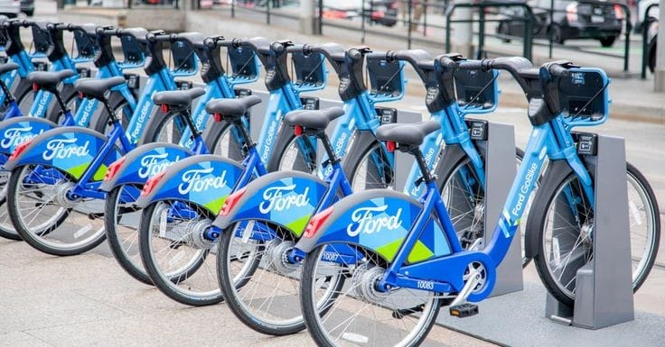

# Ford GoBike Data Analysis & Visualization 🚴‍♂️

This project presents an in-depth **Exploratory Data Analysis (EDA)**, **Visualization**, and **Storytelling** on the **Ford GoBike** dataset, uncovering meaningful insights about bike-sharing usage patterns across different user demographics, locations, and time periods.

---

---

## 📋 Project Overview:
- **Dataset:** Ford GoBike System Data
- **Total Records:** 10,324 rides
- **Features:** Start/End Time, Station Details, User Type, Member Gender, Trip Duration, Geolocation, and more.
- **Objective:** Analyze user behavior, peak times, station trends, and optimize operational strategies.

---

## 📈 Key Analysis Conducted:
- **Univariate Analysis:** Individual feature distributions (trip durations, user types, etc.)
- **Bivariate Analysis:** Relationships between pairs of features (gender vs user type, trip frequency vs weekdays, etc.)
- **Multivariate Analysis:** Combined feature interactions and geospatial analysis using interactive maps.

---

## 📊 Some Highlights:
- 🚴‍♀️ Most trips happen between **7-9 AM** and **4-6 PM** (commute peaks).
- 🌎 **India, Nigeria, and UAE** emerged as top locations for trip density.
- 🗓️ **April to July** months show seasonal demand peaks.
- 🌍 Created **interactive map visualizations** to explore station usage geographically.

---

## 🔧 Tools & Technologies Used:
- **Python**: Data wrangling, preprocessing, and analysis
- **Pandas, NumPy**: Data manipulation
- **Matplotlib, Seaborn**: Static visualization
- **Plotly**: Interactive visualizations
- **Jupyter Notebook**: Analysis environment

---

## 🚀 How to Explore This Project:
1. Clone the repository.
2. Open the Jupyter Notebook: `FordBike.ipynb`.
3. Run the cells to view charts, maps, and insights.

